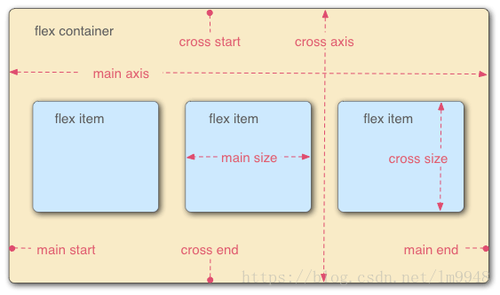

# 10天精通css3
## 第一章
---
### 1.不同浏览器及其前缀

|    浏览器      |   前缀  |  内核  |
|:-:            |:---:    |:--:|
| chrome/safari | -webkit |Webkit / blink|
|  firefox      | -moz    |Gecko  |
|     IE        |  -ms    |Trident|
|     opera     |  -o     |Presto |
|||

### 2.特性

#### 选择器    能够减少标签中class和id的使用数量，很好的实现结构和样式分离

#### 圆角效果
    border-radius

#### 块阴影与文字阴影
    对任意DIV和文字增加投影

#### 渐变效果
    以前只能用Photoshop做出的图片渐变效果，现在可以用CCS写出来了

#### 个性化字体
    @Font-Face 轻松实现定制字体

#### 多背景图
    一个元素上添加多层背景图片

#### 变形处理
    对HTML元素进行旋转、缩放、倾斜、移动、甚至以前只能用JavaScript实现的强大动画

#### 变形处理
    对HTML元素进行旋转、缩放、倾斜、移动、甚至以前只能用JavaScript实现的强大动画

### CSS2补充
1. 行级元素 内容决定所占的位置，不可以通过css改变宽高

>span strong em a  

2. 块级元素 独占一行 可以通过css改变宽高

>div p ul li form ol 

3. 行级块元素

>内容决定大小 可以改变宽高

`可以通过改变display 的属性 修改行元素 还是块元素`

`凡是带有inline 属性的元素都带有文字属性 换行会导致元素之间有六像素的间距 处理的办法是不加空白字符`

4. *通配符选择器可以用来初始化所有的标签

```css
*{ 
    padding: 0;
    margin: 0;
    text-decoration: none; 
    line-style: none
}
```

`因为通配符的权重最低，随便一个选择器就可以修改被通配符有初始化后的元素`

### 定位
>`position`可以把元素变成定位元素，之后可以使用left right 移动元素。

```CSS
position:absolute|relative|fixed;
```

|定位|特性|
|:--|:--|
|absolute|脱离原来的层进行定位，`不再占据原来层的位置`。相对有最近有定位属性的父级进行定位，如果没有，则相对于文档定位。|
|relative|脱离原来的层进行定位，`但是占有原来层的位置`。相对于自己出生的位置进行定位。|
|fixed|固定在某个位置，使用left right top bottom 移动位置|
|||

### 浮动
1. 作用： 让元素排队

2. 规则：浮动元素产生了浮动流，所有产生了浮动流的元素，块级元素就看不到他们，但是产生了bfc的元素，文本类属性（inline-block）的元素，文本元素依然可以看到他们（浮动元素）。看不到他们，就当他们不存在，接着渲染。

3. 问题：父级是块级元素，子元素是浮动元素， 父级因为看不到而没有办法包住他们。

4. 解决：在浮动流元素后加一个p标签，p{ clear: left / right / both }，这个办法不好，引入了没有用的结构。
   1. 使用伪元素，在父元素上加上 ::after{ content: " ";clear: both;display: block}  清除浮动流三件套
   2. 把父元素变成bfc元素或者变成带有文本属性（inline- block）的元素

>`设置了position: absoulate / float : left / right 的元素会在系统内部变成inline-block `


## 第二章边框
---

### 2-0 CSS2知识

```CSS
border : 2px solid green  => border-width  border-style  border-corlor 
border-width : 粗细
border-style : solid dotted dashed  
border-corlor: 颜色的标识方法

/*也可以分别设置*/
border-left-color:
border-right/top/bottom: 2px solid
```

#### 2-1、基础使用
```css
border-radius:10px;/*只有一个值时，全部的圆角*/
```
```css
border-radius: 5px 4px 3px 2px;/* 有四个值时顺时针，左上、右上、右下、左下*/
```

上半圆：高为宽的一半，左上和右上的border-radius的值和高一致
``` CSS
.wrapper1{
    width: 200px;
    height: 100px;
    border-radius: 100px 100px 0 0;
}
```

实心圆：把宽度（width）与高度(height)值设置为一致（也就是正方形），并且四个圆角值都设置为它们值的一半。
``` CSS
.wrapper1{
    width: 200px;
    height: 200px;
    border-radius: 100px;
}
```
#### 2-2、阴影 box-shadow
可以为一个div添加一个或多个阴影

```CSS
box-shadow: X轴偏移量 Y轴偏移量 [阴影模糊半径] [阴影扩展半径] [阴影颜色] [投影方式];
```
|    值      |   描述  |
|:---            |:---   |
| X轴偏移量 | 必需。水平阴影偏移量，正值表示阴影在右边，负值表示阴影在左边 |
|Y轴偏移量  | 必需。垂直阴影偏移量，正值表示阴影在上边，负值表示阴影在下边    |
|阴影模糊半径| 可选。只能为正值，值为0时，表示阴影不具有模糊效果，值越大阴影的边缘就越模糊。|
|阴影扩展半径| 可选。可正可负，正值表示整个阴影都延展扩大，负值表示缩小。 |
|投影方式| 外部阴影-outset 内部阴影-inset |
|||

### 2-3、边框背景图片
```css
border-image:url(borderimg.png) 70 70 70 70 repeat;/* url的参数为字符串 图片路径，70 70 70 70 遵循顺时针原则，上右下左，单位是像素，也支持百分比  延伸方式由三种 repeat - 重复 round - 平铺 stretch - 拉伸*/
```

## 第三章 颜色
---
### 1、rgba()是红绿蓝三原色加上alpha通道
```CSS
color：rgba(R,G,B,A,0.3) /*前三个参数的取值范围是0-255 第四个的范围是0-1*/
```
### 2、线性渐变
线性渐变语法
```css
/*linear-gradient(top left,color1 color2,color3,color4 ... );*/
background-image: linear-gradient(to left,rgb(240, 140, 82), rgb(230, 61, 75));
background-image:linear-gradient(to left, red, orange,yellow,green,blue,indigo,violet);

```

|    角度      |   英文     |   作用    |
|:---          |  :---     |  :---     |
|      0deg    |  to top   |  从下向上  |
|      90deg   | to right  |  从左向右  |
|     180deg   | to bottom |  从上向下  |
|      270deg  |  to left  |  从右向左  |
|        -     |  to top left   |  右下向左上  |
|        -     |  to top right  |  左下向右上  |
||||

## 第四章 文字
---
### 0. css2相关知识

a. font-size 

b. font-weight :  lighter normal bold bolder  100 - 900

c. font-style: italic

d. font-family:  arail 宋体 微软雅黑

e. color：green red, #ccc,rgba(224,36,10, .4) 

f. text-align: center left right 

g. line-height: 16px

`当在一个容器里让文字垂直居中时只要让文字的line-height = 容器的高度 `

h. text-indet: 2em **首行缩进**两个汉字

i. text-decoration: line-through [删除线]  underline [下划线] overline [上划线] none


### 1.text-overflow 和 word-wrap
text-overflow 是用来设置文字溢出所在区域是否设置成一个 `缺省标记`
```css
text-overflow:clip||ellipsis /*clip表示剪切 ellipsis表示显示成一个缺省标记 ... */
```
但是text-overflow只是设置了文字溢出所在区域后怎么显示，要想显示一个`缺省标记`，还要设置**overflow:hidden**溢出隐藏和 **white-space:nowrap** 强制在一行显示文本。`注意：`text-overflow,overflow,white-space这些属性是写在文本元素上的，不是父元素。
```css
.font p{
    text-overflow:ellipsis;
    overflow:hidden;
    white-space: nowrap;
}
```
word-wrap是用来控制在行尾是否拆开单词，默认值是``normal``即是不拆开单词，也有``break-word``选项表示拆开单词换行。这个属性真的不常用，一般用浏览器默认的就好
```css
word-wrap: break-word;
```

### 2.@font-face
`@font-face`像一个语法糖，加载来自服务器端的字体，语法如下
```css
@font-face{
    font-family: "MOOC FONT";
    src:url("http://www.imooc.com/Amaranth-BoldItalic.otf")
}
```
之后就可以使用font-*来使用字体了。语法如下：
```css
font-family: "MOOC FONT";/*必须写，且需要制定为@font-face 引入的字体名*/
font-weight:500;
font-size: 18px;
```

### 3. text-shadow
```CSS
text-shadow: X-Offset Y-Offset blur color;
```

|    值      |   描述                                       |
|:-:         |:---:                                         |
| X-Offset   | 阴影水平偏移的距离，正值向右，负值向左          |
| Y-Offset   | 阴影垂直偏移的距离，正值向上，负值向下          |
|    blur    | 模糊程度，不可为负，0表示没有效果，越大越模糊    |
|||

## 第五章 背景
---
### 1、 background-origin
`background-origin` 描述的是背景图片从哪里开始显示。默认从内边距开始展示。
```CSS
background-origin: border-box | padding-box | content-box;
```
`注意：`如果背景不是no-peat，这个属性无效，会从`边框`开始显示

### 2、 background-clip
`background-clip` 裁切背景图片，满足需要。语法如下，默认会裁掉边框以外的部分，`no-clip`表示从不裁切。
```css
background-clip: border-box | padding-box | content-box |no-clip;
```

### 3、 background-size

`background-size` 背景图显示，默认值`auto`表示按照原图片显示，语法如下：
```CSS
background-size: auto | <长度值> | <百分比> | cover | contain
```

|    值      |   描述                                       |
|:-:         |:---:                                         |
| auto   | 原尺寸显示          |
| 长度值   | 成对出现，分别表示宽高；如果只写一个表示宽，高等比缩放  |
| 百分比   | 1%-100%。将背景图片的宽高依次设置成所在元素的宽高的百分比，如果设置一个值，设置宽，高等比缩放    |
| cover   | 如词意，封面，拉伸覆盖    |
| contain   | 适应最大边，另一边等比缩放    |
|||

### 3、 multiple-backgrounds
>给一个元素添加多个背景。

`缩写写法`
```css
background ： [background-color] | [background-image] | [background-position][/background-size] | [background-repeat] | [background-attachment] | [background-clip] | [background-origin],...
```

`拆解写法`
```css
background-image:url1,url2,url3...urlN;
background-repeat:repeat1,repeat2,repeat3...repeatN;
background-position:position1,position2,position3...positionN;
background-attachment:attachment1,attachment2,attachment3...attachmentN;
background-origin: origin1,origin2,origin3...originN;
background-clip: clip1,clip2,clip3...clipN;
background-size: size1,size2,size3...sizeN;
background-color:color;
```
`注意：`
1. 逗号隔开没组值；
2. 如果有 size 值，需要紧跟 position 并且用 "/" 隔开；
3. 如果有多个背景图片，而其他属性只有一个（例如 background-repeat 只有一个），表明所有背景图片应用该属性值；
4. background-color 只能设置一个。

## 第六章 选择器
---
### 1.属性选择器添加`通配符` E[attr X=val]

|属性选择器|功能描述|
|:-:         |:---:                                         |
| E[attr^=val]   |选择元素E，且E定义了属性attr，且attr属性的值`以val开头`|
| E[attr$=val]   |选择元素E，且E定义了属性attr，且attr属性的值`以val结尾`|
| E[attr*=val]   |选择元素E，且E定义了属性attr，且attr属性的值`包含val`|
|||

```CSS
a[class^=icon]{ /*class以icon开头*/
  background: green;
  color:#fff;
}
a[href$=pdf]{ /*herf以pdf结尾*/
  background: orange;
  color: #fff;
}
a[title*=more]{ /*title包含more*/
  background: blue;
  color: #fff;
}
```
### 1.1 简单选择器的权重
>`不同简单选择器的权重值不同，值的进制是255`

|选择器|权重|
|:--|:--:|
|!important|infinity|
|行间样式|1000|
|id|100|
|class/伪类/属性|10|
|标签/伪元素|1|
|通配符|0|
|||

### 1.2复杂选择器
|选择器|语法|
|:--|:--:|
|父子（派生）选择器|简单选择器[空格]简单选择器|
|直接子元素选择器  |简单选择器>简单选择器|
|并列选择器       |简单选择器简单选择器|
|分组选择器       |简单(复杂)选择器,简单(复杂)选择器|
|||

`注意：`并列选择器，当标签和class并列的时候，class写在前

### 1.3 选择器权重的计算

>把在一行上的选择器的权重加起来

>`注意：`infinity+1 > infinity

### 2.结构性伪类选择器--root

```CSS
:root{
    background:#333;
}/*等价*/
html{
   background:#333; 
}
```

### 3.结构性伪类选择器--E:not([attr=val])

>选择除attr=val的所有元素
```CSS
.nav li:not(:first-child)::before{
    content: '';
    position: absolute;
    height:15px;
    width: 1px;
    top:0;
    bottom:0;
    left: 0;
    margin: auto;
    background-image: linear-gradient(to top,rgba(255, 221, 221,0),rgba(255, 255, 255,.8),rgba(255, 221, 221,0));
}
input:not([type="submit"]){
  border:1px solid red;
}
```

### 3.结构性伪类选择器--E:empty
>选择`没有任何内容`的元素,这里的没有大概意思是`none`，不是空格
```CSS
p:empty{
    display:none
}
```

### 4.结构性伪类选择器--E:target

### 5.结构性伪类选择器--E:first-child
>E:first-child表示选择`父元素`的`第一个` **子元素**
```CSS
ol li:first-child{
        color: chartreuse;
    }
```

### 6.结构性伪类选择器--E:last-child
>E:last-child表示选择`父元素`的`最后一个` **子元素**
```CSS
ol li:last-child{
    color: chartreuse;
}
```
### 7.结构性伪类选择器--E:nth-child(n)
>E:nth-child(n)表示选择`父元素`的`一个或多个指定元素`

>n 

>- 可以是整数(1,2,3,4)

>- 也可以是表达式(2n+1|2n)

>- 也可以是关键字(odd|even)
```CSS
ol li:nth-child(odd){
    color: chartreuse;
}  
```

### 8.结构性伪类选择器--E:nth-last-child(n)
>E:nth-last-child(n)表示选择`父元素`的`一个或多个指定元素`,与:nth-child(n)的区别是，:nth-last-child(n)选择则的是从最后一个元素开始
n 
    可以是整数(1,2,3,4)        倒数前四个
    也可以是表达式(2n+1|2n)   
    也可以是关键字(odd|even)
```CSS
ol li:nth-last-child(5){  /*倒数第五个的颜色*/
    color: chartreuse;
}  
```

### 9.结构性伪类选择器--E:first-of-type
>E:first-of-type表示选择`父元素`的`第一个指定类型的` **子元素**
```CSS
wrap div:first-of-type{
        color: chartreuse;
    }
```

`注意：`:fist-child表示父元素下第一个子元素，:first-of-type表示父元素下一个指定类型的子元素。

### 10.结构性伪类选择器--E:last-of-type
>E:last-of-type表示选择`父元素`的`最后一个指定类型的` **子元素**
```CSS
wrap div:last-of-type{
    color: chartreuse;
}
```

### 11.结构性伪类选择器--E:nth-of-type
>:nth-of-type(n)和:nth-child(n)在功能上非常类似，但是:nth-of-type(n)只是计算父元素下指定类型的的元素的个数。n的用法是一样的

### 12.结构性伪类选择器--E:nth-last-of-type
>:nth-last-of-type(n)和:nth-last-child(n)在功能上非常类似，但是:nth-last-of-type(n)只是计算父元素下指定类型的的元素的个数。n的用法是一样的

### 13.结构性伪类选择器--E:olny-child 
>:only-of-child选择父元素下唯一一个子元素

### 14.结构性伪类选择器--E:olny-of-type
>:only-of-typex选择父元素下唯一一个类型的元素


## 第七章 选择器
---
### 1.:enabled选择器 和 disabled
>form表单里的某些元素，有的含有`enabled`属性，:enable可以选择这些元素，当禁用的时候`:disabled`选择器可以选择它们。
```CSS
input[type="text"]:enabled{
    background: #ccc;
    border: 2px solid springgreen;
}
input[type="text"]:disabled{
    background: #ccc;
    border: 2px solid springgreen;
}
```

### 2.:enabled选择器 和 disabled
```CSS
input[type="checkbox"]:checked + span{
    opacity: 1;
}
```

### 3.伪元素选择器 ::selection
>用来选择那些突出显示的文字，比如 `被鼠标选中的文字`

>`被鼠标选中的文字`默认情况下是蓝色的背景，白色的文字

`注意：`

1. IE9+、Opera、Google Chrome 以及 Safari 中支持 ::selection 选择器。

2. Firefox 支持替代的 ::-moz-selection。

```CSS
::selection{
    background: orchid;
    color: papayawhip;
    text-shadow: 0 1px 3px;
    line-height: 19px;
}
```

### 4.伪元素选择器 :read-only 和 :read-write
>用来选择那些`只读`和`非只读`的input框
```CSS
input[type="text"]:not(:read-only){
    border: 1px solid rgb(170, 128, 72);
    border-radius: 2px;
    padding: 5px;
    background: #fff;
    box-shadow: 0 1px 5px rgb(233, 72, 72);
}
input[type="text"]:read-only{
    border: 1px solid #ccc;
    color: whitesmoke;
}
```

### 4.伪元素选择器 ::before 和 ::after
>`::before`和`::after`是用来给元素前后插入内容的，常和`content`一起使用，使用的场景多是用来清除浮动和做一些样式效果

## 第八章 动画
### 1、旋转 rotate()
```CSS
.wrapper > div:hover{
    -webkit-transform: rotate(45deg);
}
```

### 2、扭曲 skew()
>1. `skew(x,y)`是让元素分别在X轴和Y轴方向上斜切，如果只给一个值则是在X轴上斜切，Y轴值为0
>2. `skewX()` 和 `skewY()`是分别在X、Y轴上斜切

```CSS
.skew div{
    width: 200px;
    height: 200px;
    background: chartreuse;
    transform: skew(30deg,30deg);
    line-height: 200px;
    text-align: center;
    color: rgb(255, 0, 0);
    font-size: 12px;
}
```

### 3、缩放 scale()
>1. `scale(x,y)`是让元素分别在X轴和Y轴方向上缩放，如果只给一个值则是在X轴上缩放，Y轴值为0
>2. `scaleX()` 和 `scaleY()`是分别在X、Y轴上缩放

`注意：` scale()的取值默认的值为1，当值设置为0.01到0.99之间的任何值，作用使一个元素缩小；而任何大于或等于1.01的值，作用是让元素放大。

```CSS
.scale > div{
    width: 200px;
    height: 200px;
    background: #376608;
    transform: scale(.8,1.2);
}
```

### 4、移动 translate()
>1. `translate(x,y)`是让元素分别在X轴和Y轴方向上移动，如果只给一个值则是在X轴上移动，Y轴值为0
>2. `translateX()` 和 `translateY()`是分别在X、Y轴上移动

`注意：` translate() 像 `position relative`一样，可以在X、Y轴上移动，而不会影响其他元素。

```CSS
.wrapper div {
    width: 200px;
    height: 200px;
    line-height: 200px;
    text-align: center;
    background: orange;
    color: #fff;
    -webkit-transform: translate(50px,100px);
    -moz-transform:translate(50px,100px);
    transform: translate(50px,100px);
}
```

### 5、矩阵 matrix()

### 6、 tranform-origin
>修改元素的中心位置
```CSS
.transform-origin div {
    transform-origin: left top;
}
```
值主要有以下几种情况：
|关键词|百分比(%)|
|:-         |:---                                         |
| top = top center = center top   |  50% 0  |
| right = right center = center right   |  100% 50%  |
| bottom = bottom center = center bottom   |  50% 100%  |
| left = left center = center left   |  0 50%   |
| center = center center |  50% 50%  |
| top left = left top |  0 0  |
| top right = right top |  100% 0  |
| bottom left = left bottom |  0 100%  |
| bottom right = right bottom |  100% 100%  |
|||

### 7、 transition-property
>css3增加了transition模块，可以通过`鼠标单击`、`获得焦点`、`被点击`、`对任何元素改变`触发，并且平滑的改变css的属性值。

实现动画，分以下步骤：
1. 在默认样式中声明`初始状态`；
2. 声明过渡元素的`最终状态样式`；
3. 在默认样式中通过添加`过渡函数`，添加不同的样式。

`transition`是一个复合属性，包含以下子属性
|属性|含义|
|:-         |:---|
| transition-property |  指定动态模拟或动态的CSS属性  |
| transition-duration |  指定完成过渡所需的时间  |
| transition-timing-funtion |  指定过渡函数  |
| transition-delay |  指定过渡出现的延迟时间  |
|||

>`transition-property`用来指定过渡动画的CSS属性，只有具有`中间值的css属性`才能具有过渡效果。具有过渡效果的CSS属性有：

||||
|:-|:-|:-|
| background-color | background-position | border-bottom-color |
| border-bottom-width | border-left-color | border-left-width |
| border-right-color | border-right-width | border-spacing |
|  border-top-color | border-top-width | bottom |
|  clip | color | font-size |
|  font-weight | height | left |
|  letter-spacing | line-height | margin-bottom |
|  margin-top | margin-left | margin-right |
|  max-height | max-weight | min-height |
|  opcity | outline-color | outline-width |
|  padding-bottom | padding-top | padding-right |
|  padding-left | right | text-indent |
|  text-shadow | vertical-align | visibility |
|  width | z-index | word-spacing |
||||

`注意：`假如transition-property设置了all，则是所有设置的中间值的属性都会过渡。

### 8、 transition-duration
>`transition`子属性中的过渡时间，指的是完成过渡的耗时

### 9、 transition-timing-function 
>`transition`子属性中的过渡函数，指的是用什么方式完成过渡，比如`ease`是由初始到最终样式，由快到慢，逐渐到慢


### 9、 Keyframes 

>用来声明一个动画语法如下
```CSS
@keyframes changeColor{
    0%{
        background-color:red;
    }
    100%{
        background-color:green;
    }
}
```

`注意：`
1. 可以用from to 分别代表0%和100%
2. 可以在0和100%之间设置多个百分比

### 9、 animation-name
>用于调用`keyframes`声明的动画。

```CSS
div span {
  display: inline-block;
  width: 20px;
  height: 20px;
  background: orange;
  border-radius: 100%;
  animation-name:around;
  animation-duration: 10s;
  animation-timing-function: ease-in-out;
  animation-delay: 1s;
  animation-iteration-count:infinite;
}
```
>`animation-iteration-count:infinite;`声明动画重复次数无穷。infinite可以替换为`整数`

### 10、animation-direction
>主要用来设置动画播放方向，语法如下

```CSS
animation-direction: normal | alternate [,normal | alternate]*
```
1、默认值是`normal`，表示每次循环都是向前播放；

2、`alternate`表示偶数次向前，奇数次向相反的方向播放。

### 11、animation-play-state 动画播放状态

```CSS
animation-play-state: paused | running;
```
```CSS
span {
    display: inline-block;
    width: 20px;
    height: 20px;
    background: orange;
    transform: translateY(90px);
    animation-name: move;
    animation-duration: 10s;
    animation-timing-function: ease-in;
    animation-delay: .2s;
    animation-iteration-count:infinite;
    animation-direction:alternate;
    animation-play-state:paused;
}
div:hover span {
    animation-play-state:running;
}
```

### 12、animation-fill-mode 动画播放状态
>用于设置动画开始前和动画结束以后动画的行为，主要有四个值，展示如下

|属性|效果|
|:-         |:---|
| none |  初始时不在第一个关键帧，结束后返回第一个关键帧  |
| forwards |  结束时返回第一个关键帧  |
| backwords |  开始时在第一个关键帧  |
| both |  拥有forwards和backwards双重效果  |
|||

>`补充:`
1. margin 一个值表示，上、右、下、左四个方向的外边距都是那个值
          两个值，表示上下外边距第一个值，左右外边距第二个值
          三个值，表示上第一个值，左右第二个值，下第三个值

2. 取消边框
```CSS
.nav-menu > li:last-child {
    border-right: none;
}
```
3. 

## 弹性布局
>弹性布局基础



`注意，设为Flex布局以后，子元素的float、clear和vertical-align属性将失效。`

### 1. 容器属性


### 2. 项目属性
2.1 order
>默认为0，值越大越靠前，可以为负数

2.2 flex属性
```css
flex: none |[ <flex-grow> <flex-shrink> || <flex-basis>] 
```
|属性|描述|
|:---|:---|
|flex-grow|放大比例，默认为0，即是有空间也不放大，如果值为2则占有多一倍的空间|
|flex-shrink|缩小比例，默认为1，即是空间不足的时候缩小，都为1时，同比例缩小。如果A元素flex-shrink值为0，B元素flex-shrink值为1，则空间不足的时候0不缩小，1缩小|
|flex-basis|固定大小，值为具体像素值|
|||

>`注意：`grow 意为长大，默认为0，当为0时不放大；shrink 意为缩小，默认为1，当为0时不缩小。

```CSS
flex:auto; /*flex: 1 1 auto; 会放大，缩小，自动*/
flex:none; /*保持定义尺寸不再弹性布局*/
```


